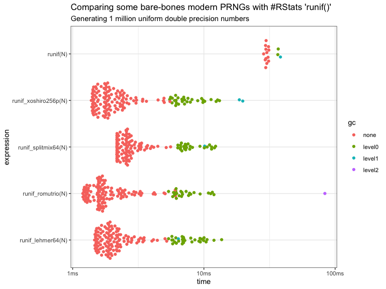

<!-- README.md is generated from README.Rmd. Please edit that file -->

# miranda 

<!-- badges: start -->


<!-- badges: end -->

The `miranda` packages includes some modern pseudo-random number
generators (PRNGs). These are up to 20x faster than the built-in PRNGs
in R.

  - [romu trio](https://www.romu-random.org/)
  - [xoshiro256+](http://xorshift.di.unimi.it)
  - [Lehmer64](https://lemire.me/blog/2019/03/19/the-fastest-conventional-random-number-generator-that-can-pass-big-crush/)
  - [SplitMix64](http://xorshift.di.unimi.it/splitmix64.c)

### PRNG summary

| PRNG                         | BigCrush result          | Reference                                                                                                                    |
| ---------------------------- | ------------------------ | ---------------------------------------------------------------------------------------------------------------------------- |
| xoshiro256p                  | “No Systematic Failures” | <http://prng.di.unimi.it/>                                                                                                   |
| lehmer64                     | Passes                   | [Lemire’s blog](https://lemire.me/blog/2019/03/19/the-fastest-conventional-random-number-generator-that-can-pass-big-crush/) |
| splitmix64                   | Passes                   | [source](http://xorshift.di.unimi.it/splitmix64.c)                                                                           |
| romutrio                     | Passes                   | [romu-random.org](romu-random.org)                                                                                           |
| runif() \[Mersenne Twister\] | Two failures             |                                                                                                                              |

## Installation

You can install from [GitHub](https://github.com/coolbutuseless/miranda)
with:

``` r
# install.package('remotes')
remotes::install_github('coolbutuseless/miranda)
```

## `xoshiro256p`

``` r
library(miranda)

# Set the seed
set_seed_xoshiro256p(2020)

# Get the internal state of the generator. 32 bytes.
(state <- get_state_xoshiro256p())
#>  [1] ee 6d 45 f5 0b 1c e9 8e 81 89 5b 6b ee ca 13 07 d9 3f 76 fe 13 4f c2 33 44
#> [26] 3c a9 de 5e b7 56 f9

# Generate some uniform random numbers from xoshiro256+
runif_xoshiro256p(5)
#> [1] 0.5322239 0.7788869 0.4601653 0.8475389 0.9540731

# Jump ahead. As if 2^128 numbers had been generated
jump_xoshiro256p()

# Generate some uniform random numbers from xoshiro256+
runif_xoshiro256p(5)
#> [1] 0.5714143 0.5006207 0.6907487 0.2625934 0.5053289

# reset the state to a prior value
set_state_xoshiro256p(state)

# Generate some uniform random numbers from xoshiro256+
runif_xoshiro256p(5)
#> [1] 0.5322239 0.7788869 0.4601653 0.8475389 0.9540731
```

# Benchmark: Generating 1 million uniform random numbers

<details>

<summary> Click to show/hide bench::mark() code </summary>

``` r
N <- 1e6
res <- bench::mark(
  runif_xoshiro256p(N),
  runif_lehmer64(N),
  runif_splitmix64(N),
  runif_romutrio(N),
  runif(N),
  check = FALSE
)
```

</details>



  - The PRNGs in this package all roughly run at the same speed
  - At their best, these PRNGs are about **20x faster** than `runif()`

## Related Software

  - [dqrng](https://cran.r-project.org/package=dqrng) - Fast PRNGs
    (xoshiro, PCG) with an interface compatible with `runif()`. Also
    supplies `rnorm()`
  - [random](https://cran.r-project.org/package=random) a package for
    true random numbers fetched from [random.org](random.org)

## Acknowledgements

  - R Core for developing and maintaining such a wonderful language.
  - CRAN maintainers, for patiently shepherding packages onto CRAN and
    maintaining the repository
